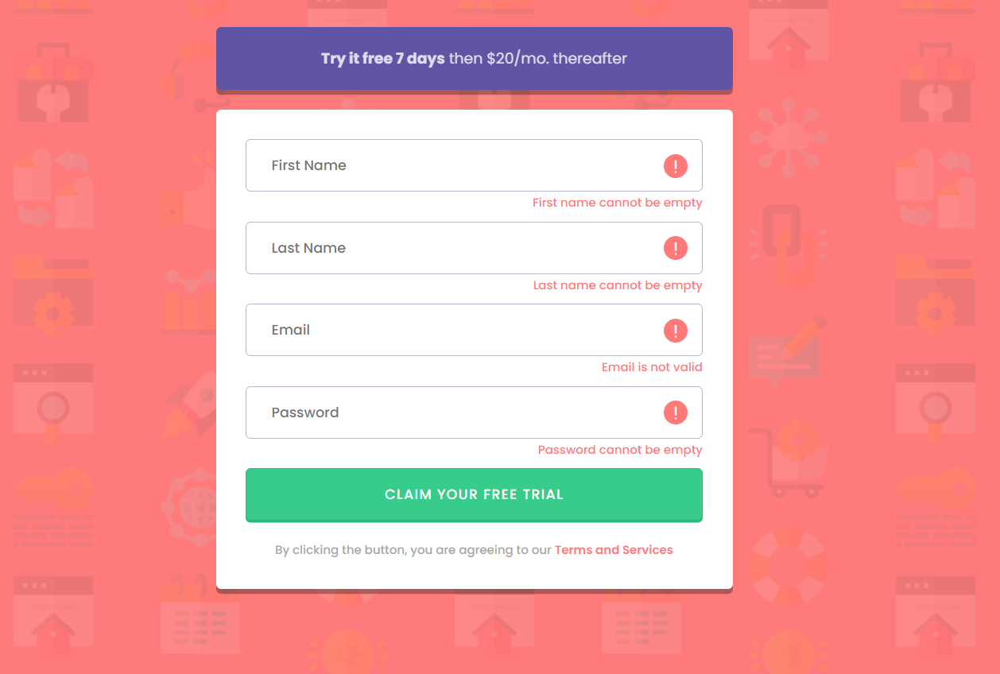

# UIB-Trial-Form

## Let's try to create this trial form

### Normal Desktop Design

- [ ] Use colors and font in style guide

- [ ] Add the background image

- [ ] Try to style inputs as shown in reference images

- [ ] style input focus states, change border colors, etc...

### Bonus

- [ ] Use positioning to add in the images and small text shown in the error-design png.

